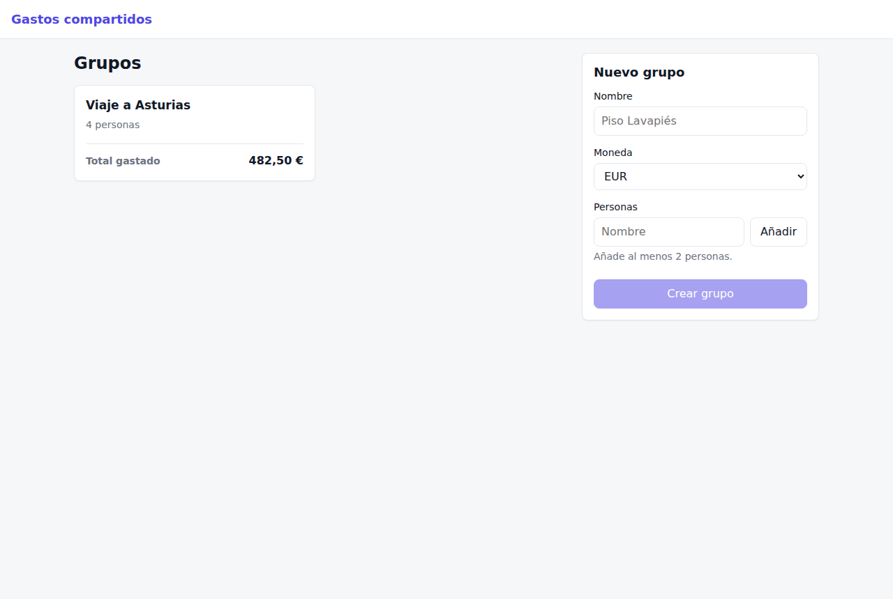
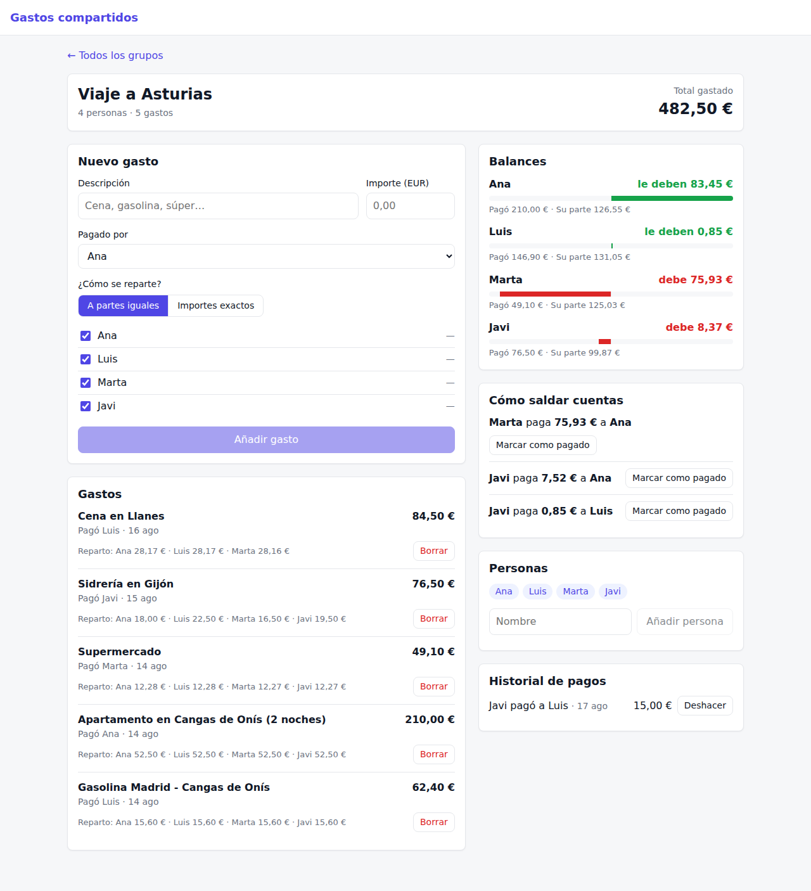

# Gastos compartidos

App para repartir gastos en grupo, al estilo Splitwise: apuntas quién paga qué, la app calcula
cuánto debe cada persona y propone unas pocas transferencias para quedar en paz.

- **Backend:** FastAPI + SQLAlchemy 2.0 + Pydantic v2 + SQLite (`backend/`)
- **Frontend:** Angular 21 con signals y componentes standalone (`frontend/`)

## Arrancar en local

```bash
# Backend (Python 3.11+)
cd backend
python -m venv .venv
source .venv/bin/activate
pip install -r requirements-dev.txt
uvicorn app.main:app --reload --port 8000   # docs en http://localhost:8000/docs

# Frontend (otra terminal, Node 20.19+, 22.12+ o 24+)
cd frontend
npm install
npm start                                    # http://localhost:4200
```

La primera vez se crea `shared_expenses.db` con un grupo de ejemplo, "Viaje a Asturias".

## Tests

```bash
cd backend && pytest
cd frontend && npx ng test --watch=false
```

## Capturas

| Grupos | Detalle de un grupo |
| --- | --- |
|  |  |

## Decisiones

- **Dinero en céntimos enteros**, nunca `float`. Al repartir 10,00 € entre 3, los céntimos que
  sobran van uno a uno a las primeras personas: 3,34 + 3,33 + 3,33.
- **Saldar cuentas** (`backend/app/services/settlement.py`): algoritmo voraz; quien más debe paga
  a quien más tiene que recibir. Con *n* personas salen como mucho *n − 1* transferencias.
- **Balance neto** = pagado − su parte + pagos enviados − pagos recibidos. Positivo: le deben dinero.
- Los errores de negocio devuelven `422 {"detail": "mensaje en español"}` y la interfaz los muestra tal cual.

## API

| Método | Ruta | Descripción |
| --- | --- | --- |
| GET | `/api/groups` | Grupos con nº de personas y total gastado |
| POST | `/api/groups` | Crear grupo (mínimo 2 personas) |
| GET | `/api/groups/{id}` | Detalle: personas, gastos y pagos |
| POST | `/api/groups/{id}/members` | Añadir persona |
| POST | `/api/groups/{id}/expenses` | Añadir gasto (`equal` o `exact`) |
| DELETE | `/api/groups/{id}/expenses/{expenseId}` | Borrar gasto |
| POST | `/api/groups/{id}/payments` | Registrar un pago entre dos personas |
| DELETE | `/api/groups/{id}/payments/{paymentId}` | Deshacer un pago registrado por error |
| GET | `/api/groups/{id}/balances` | Balance de cada persona |
| GET | `/api/groups/{id}/settlements` | Transferencias para saldar cuentas |
